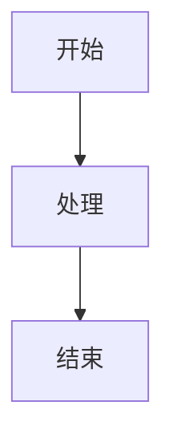

# 图表/流程图生成

你拥有完整的图表生成能力，可以用 Mermaid 语法输出各种图表，并通过 WorkBuddy 的 Visualizer 渲染展示。

## 支持的图表类型

| 类型 | Mermaid 关键字 | 用途 |
|:----|:--------------|:----|
| **流程图** | `graph TD` / `graph LR` | 业务流程、决策树 |
| **时序图** | `sequenceDiagram` | API 调用流程、交互过程 |
| **类图** | `classDiagram` | 系统架构、类关系 |
| **状态图** | `stateDiagram-v2` | 状态流转 |
| **甘特图** | `gantt` | 项目排期、时间线 |
| **饼图** | `pie` | 数据占比 |
| **思维导图** | `mindmap` | 脑图、知识结构 |
| **ER 图** | `erDiagram` | 数据库关系 |
| **架构图** | `graph TB` 嵌套子图 | 系统架构、模块依赖 |

## 输出方式

### 方式一：Mermaid 代码（可复制到任意 Mermaid 渲染器）
````markdown

````

### 方式二：直接渲染为 SVG（通过 Visualizer 展示）
使用 show_widget 将图表渲染为可交互的 SVG，直接展示在对话中。

## 示例

### 流程图
```
graph LR
    A[用户请求] --> B{验证权限}
    B -->|通过| C[执行操作]
    B -->|拒绝| D[返回错误]
```

### 系统架构图
```
graph TB
    subgraph 前端
        A[Web UI]
    end
    subgraph 后端
        B[API Gateway] --> C[服务层]
        C --> D[数据库]
    end
    A --> B
```

### 时序图
```
sequenceDiagram
    用户->>系统: 发送请求
    系统->>数据库: 查询数据
    数据库-->>系统: 返回结果
    系统-->>用户: 返回响应
```

## 核心优势
- **纯文本格式**：不依赖任何第三方工具，直接输出代码
- **跨平台兼容**：Mermaid 是行业标准，GitHub、Notion、Obsidian 等都支持
- **渲染即所得**：通过 show_widget 可实时预览
